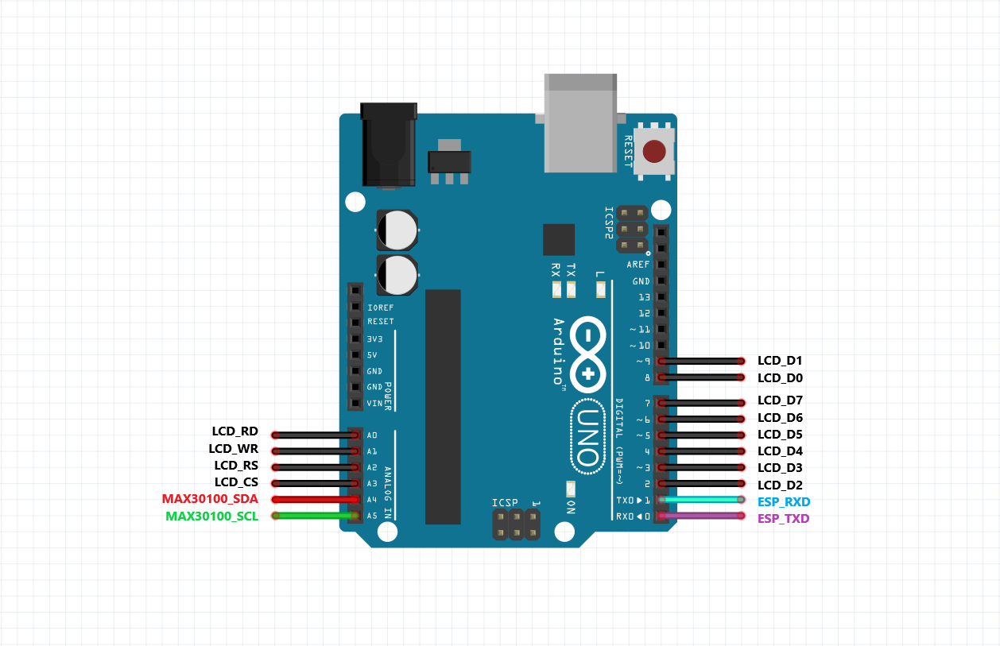

# IoT-Pulse-Oximeter
IoT Based 'Pulse Oximeter' With Arduino

### Version : 0.0.0

- #### Type : Embedded Software.

- #### Support : Arduino

- #### Program Language : Arduino

- #### Properties :

## How to use

### The IoT Pulse Oximeter system can be used as follows:   
#### 1.  Setup your thinger.io service:  
####   Watch in youtube:
[](https://www.youtube.com/watch?v=eFTKsKjfIe8)

#### 2.  Config ESP8266 & thinger.io service in 'network_chip_conf.h' header, for example:  
   * Options:  
   
      ```c++
      /* ~~~~~~ Wi-Fi Config ~~~~~~ */
      #define SSID "Your access point SSID"
      #define SSID_PASSWORD "Your access point password"

      /* ~~~~~~ IoT Config ~~~~~~ */
      #define USERNAME "Your thinger.io User Name"
      #define DEVICE_ID "Device ID on thinger.io"
      #define DEVICE_CREDENTIAL "Device Credentials on thinger.io"
      
      ```
          
          
#### 3.  Compile and upload to ESP8266 & Arduino UNO.          
     
### Hardware:  
  

## Required Library:
- [x] ThingerESP8266
- [X] SPI
- [X] Wire
- [X] MCUFRIEND_kbv
- [X] MAX30100_PulseOximeter
- [X] Adafruit_GFX

#### Developer: Majid Derhambakhsh

